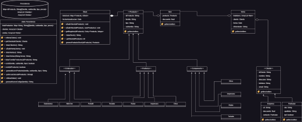

DESORDENADORL
=========
  [](https://codebeat.co/projects/github-com-innovatechdevelopers-desordenadorl-main)  

Implementación **JAVA** para control de stock de la conocida tienda de Andorra **Desordenadorl (2023).**

<div style="text-align:center"></div>

### General
<p align="justify">
Gestión de PYMES de venta de productos con un stock máximo estimado de 1.000.000 de productos en total.

Se plantea la siguiente tabla de productos como productos iniciales para ser incluidos en el stock. Con esta catalogación, dado el acuerdo obtenido con el cliente, se cubre tanto el stock actual como el futuro a corto/medio plazo.

|     IdProducto    |     Familia        |     Subfamilia              |     Tipo                |
|-------------------|--------------------|-----------------------------|-------------------------|
|     C01           |     Ordenador      |     Sobremesa               |                         |
|     C02           |     Ordenador      |     All-in-one              |                         |
|     C03           |     Ordenador      |     Portátil                |                         |
|     P01           |     Periférico     |     Ratón                   |     Alámbrico           |
|     P02           |     Periférico     |     Ratón                   |     Inalámbrico         |
|     P03           |     Periférico     |     Ratón                   |     Gamming             |
|     P04           |     Periférico     |     Teclado                 |     Alámbrico           |
|     P05           |     Periférico     |     Teclado                 |     Alámbrico + DNIe    |
|     P06           |     Periférico     |     Teclado                 |     Inalámbrico         |
|     P07           |     Periférico     |     Teclado                 |     Gamming             |
|     P08           |     Periférico     |     Monitor                 |     24”                 |
|     P09           |     Periférico     |     Monitor                 |     27”                 |
|     P10           |     Periférico     |     Monitor                 |     Otras “             |
|     P11           |     Periférico     |     Impresora               |     Tinta               |
|     P12           |     Periférico     |     Impresora               |     Láser               |
|     P13           |     Periférico     |     Impresora               |     Otras               |
|     I01           |     Componentes    |     Placa Base              |     Intel               |
|     I02           |     Componentes    |     Placa Base              |     AMD                 |
|     I03           |     Componentes    |     Procesador              |     Intel               |
|     I04           |     Componentes    |     Procesador              |     AMD                 |
|     I05           |     Componentes    |     Tarjetas Gráficas       |     nVidia              |
|     I06           |     Componentes    |     Tarjetas Gráficas       |     Gamming             |
|     I07           |     Componentes    |     Tarjetas Gráficas       |     Otras               |
|     I08           |     Componentes    |     Fuentes alimentación    |     < 650W              |
|     I09           |     Componentes    |     Fuentes alimentación    |     >= 650W             |
|     I10           |     Componentes    |     Tarjetas sonido         |     Otras               |


### Requerimientos

Código esta implementado en uso de Oracle JDK 19.0. 
Para el correcto funcionamiento del interfaz gráfico se utiliza actualmente una terminal windows bajo uso de PowerShell. No se ha previsto el uso de WSL en la aplicación.

```
Windows             11
oracle JDK          19.0
```

### Distribución del proyecto
<p align="justify">
Se presenta el proyecto desde un repositorio privado de la empresa:

Ejecutable:
```
Ubicación:
    out/artifacts/Desordenadorl_jar/Desordenadorl.jar
Ejecución:
    java -jar Desordenadorl.jar
```


Fuentes: 
```
src
```
Javadoc:
```
doc
```
Las politicas de seguridad del repositorio impiden el link ejecutable a la documentación generada como JavaDoc. No obstante procuramos dicho directorio con el objetivo de que tenga la documentación correspondiente al descargarse el proyecto.

### UML

Añadimos a la documentación el UML del proyecto para una mayor claridad del mismo (en el directorio images de el repositorio se puede obtener una versión de mayor calidad en formato jpg).

<div style="text-align:left"></div>
